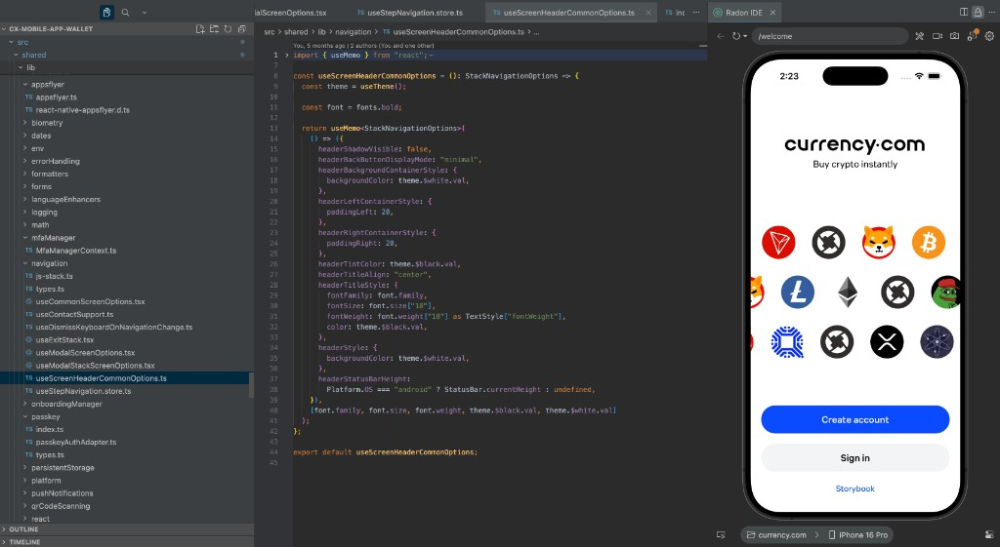
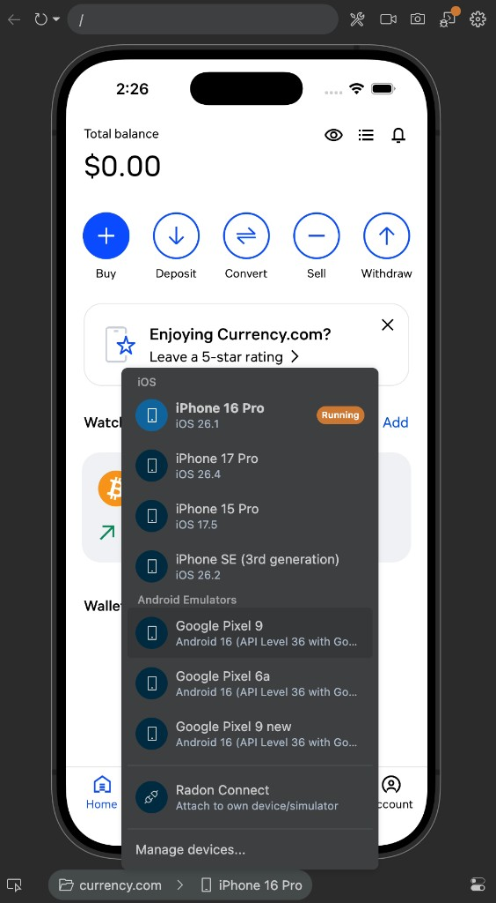
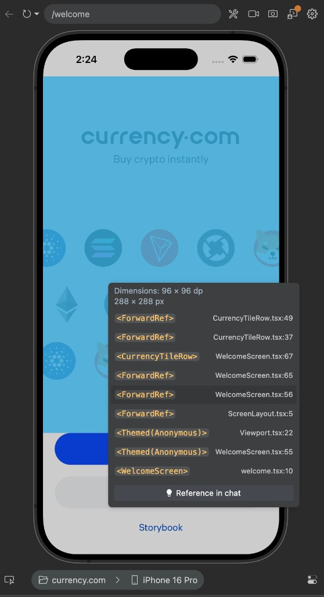
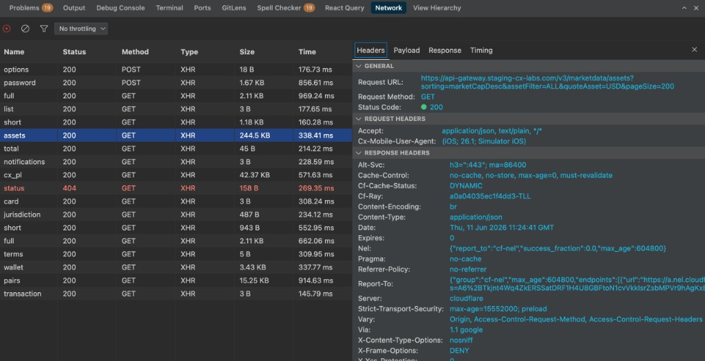
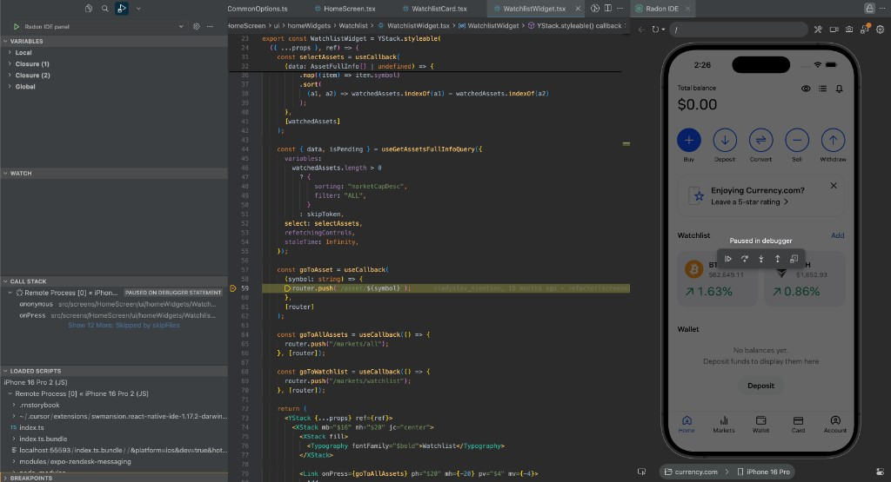
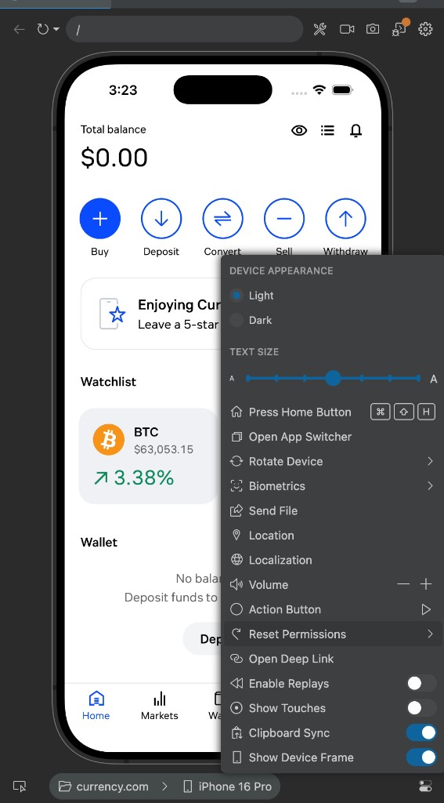
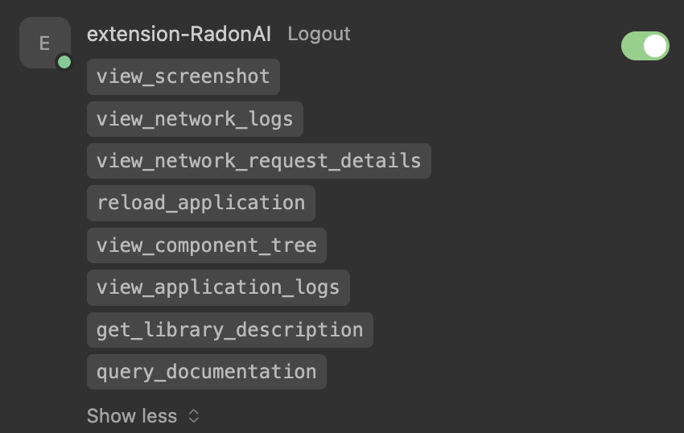
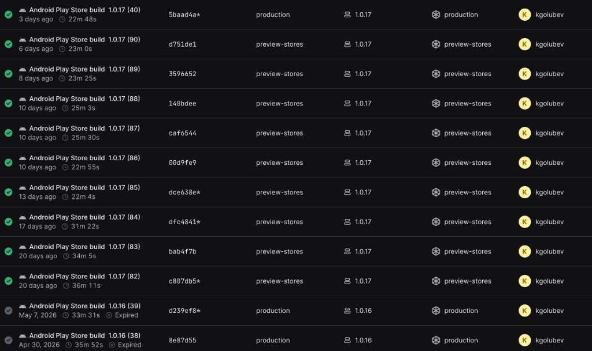

<h1 class="!text-white !mt-0 !mb-3 text-3xl font-bold">Radon IDE</h1>

<h2 class="!text-white !mt-0 !mb-0 text-lg font-normal opacity-90">Обертка над эмулятором в VSCode/Cursor</h2>

<!--
Первая тема о которой хочу рассказать - radon IDE. Познакомились с ним еще в прошлом году, когда ездили на эту же конференцию и он сильно упростил жизнь за это время.
-->

---
layout: full
---

<h2 class="!text-white !mt-0 !mb-3 text-xl font-bold whitespace-nowrap">Превью в редакторе</h2>

<ul class="!text-white text-sm space-y-2 list-disc pl-4 m-0">
<li><strong>Встроенное превью</strong> — iOS Simulator и Android emulator внутри Cursor / VS Code</li>
<li><strong>Сборки под капотом</strong> — Radon сам собирает под эмулятор</li>
</ul>

<!--
Не отдельная IDE.
Надстройка над эмуляторами IOS и Android.
Умеет сам собирать билды на нужную платформу при запуске
-->

---
layout: full
---

<h2 class="!text-white !mt-0 !mb-3 text-xl font-bold">Несколько эмуляторов</h2>

<ul class="!text-white text-sm space-y-2 list-disc pl-4 m-0">
<li>Переключение <strong>iOS и Android</strong> в одном окне редактора</li>
<li>Выбор устройства без отдельных окон Simulator</li>
<li>Быстрый контекст устройства для вёрстки и платформенных нюансов</li>
</ul>

<!--
Радон позволяет запустить сразу с несколько эмуляторов. Единственное ограничение сейчас - нельзя одновременно показать сразу несколько девайсов.
-->

---
layout: full
---

<h2 class="!text-white !mt-0 !mb-3 text-xl font-bold whitespace-nowrap">Inspect → source</h2>

<ul class="!text-white text-sm space-y-2 list-disc pl-4 m-0">
<li><strong>Inspect по правому клику</strong> на превью</li>
<li>Переход из UI в <strong>стек компонентов и исходный файл</strong></li>
<li>Быстрее ориентироваться в незнакомом коде</li>
</ul>

<!--
Правый клик по любому элементу на эмуляторе позволяет быстро перейти к его коду. Это упрощает навигацию и позволяет быстрее разобраться в чужом коде
-->

---
layout: full
---

<h2 class="!text-white !mt-0 !mb-3 text-xl font-bold">Сетевой инспектор</h2>

<ul class="!text-white text-sm space-y-1 list-disc pl-4 m-0">
<li><strong>HTTP / fetch</strong> — стабильнее, чем базовые Expo Dev Tools</li>
<li>Запросы <strong>в редакторе</strong>, рядом с кодом</li>
<li>Отладка реальных API в бизнес-приложениях</li>
</ul>

<!--
В экспо часто проблемы с нетворк инспектором, он открывается в чемто вроде хром дев тулс, и не всегда реагирует на запросы. В радоне этот функционал стабилен, и встроен прямо в ИДЕ
-->

---
layout: full
---

<h2 class="!text-white !mt-0 !mb-2 text-xl font-bold text-center">Отладчик</h2>

<ul class="!text-white text-sm space-y-1 list-disc pl-4 m-0">
<li><strong>Breakpoint'ы end-to-end</strong> — ставим в коде, пауза в эмуляторе</li>
<li><strong>Call stack и variables</strong> — в том же окне, без Chrome DevTools</li>
<li><strong>Между экранами</strong> — навигация не рвёт сессию отладки</li>
</ul>

<!--
Наконец-то есть нормальная возможность дебага кода прямо в иде. Ставим брейкпойнты, смотрим переменные и коллстек, все в лучших традициях бакэнд дебага
-->

---
layout: full
---

<h2 class="!text-white !mt-0 !mb-3 text-xl font-bold">Встроенные инструменты</h2>

<ul class="!text-white text-sm space-y-2 list-disc pl-4 m-0">
<li><strong>Address bar</strong>, <strong>deep links</strong>, <strong>биометрия</strong> — дополнительные возможности в эмуляторе</li>
<li><strong>Запись экрана</strong> — багрепорты и handoff в QA</li>
<li><strong>TanStack DevTools</strong> из коробки</li>
</ul>

<!--
У радона есть куча встроенных инструментов для упрощения работы с часто используемым функционалом. Можно вручную навигироваться на люьбой экран, открывать дип линки. Есть поддержка тестирования биометрии прямо в эмуляторе, запись экрана, а также нативная поддержка tanstack dev tools
-->

---
layout: full
---

<h2 class="!text-white !mt-0 !mb-2 text-xl font-bold whitespace-nowrap">Агенты + MCP</h2>

<strong>Radon AI</strong> — MCP-сервер в Cursor / VS Code

<ul class="!text-white text-sm space-y-1.5 list-disc pl-4 m-0">
<li><strong>Скриншот и component tree</strong></li>
<li><strong>Логи и network requests</strong></li>
<li><strong>Документация RN / Expo</strong></li>
<li><strong>Reload приложения</strong></li>
</ul>

Пример

1 · <strong>Figma</strong> — читаем макет

→

2 · <strong>Код</strong> — правим UI

→

3 · <strong>Radon</strong> — скриншот, сверка

<!--
Кроме того из коробки есть функционал связи с AI агентами через mcp сервер. он позволяет аишке смотреть скрины прямо с эмулятора, читать логи, нетворк, а также агент может сам посмотреть докуметацию реакт рейтива. В заключении хочу отметить что тул оказался очень полезным и сильно упросил мне процесс разработки.
-->

---
layout: full
---

<h1 class="!text-white !mt-0 !mb-3 text-3xl font-bold">RNRepo</h1>

<h2 class="!text-white !mt-0 !mb-0 text-lg font-normal opacity-90">Готовые нативные артефакты для популярных RN-библиотек</h2>

<!--
Перед тем как передать слово Мише - хотелось бы еще упомянуть такую полозную вещь как Rnrepo.
-->

---
layout: full
---

<h2 class="!text-white !mt-0 !mb-3 text-xl font-bold">RNRepo</h2>

Готовые нативные артефакты для популярных RN-библиотек

<ul class="!text-white text-sm space-y-1 list-disc pl-4 m-0">
<li><code class="text-xs">@rnrepo/expo-config-plugin</code> · <code class="text-xs">@rnrepo/build-tools</code></li>
<li>Ускорение <strong>EAS-сборок</strong> на Android</li>
<li><strong>~2 мин на setup</strong> — окупается на каждом CI-прогоне</li>
<li><strong>Beta</strong> · только <strong>New Architecture</strong></li>
</ul>

Подключили RNRepo

~30м → ~20м

<!--
Rnrepo - это репозиторий готовых артефактов популярных библиотек для Expo React Native. Что это значит - по сути когда мы билдим наше приложение - нам не нужно больше собирать эти библиотеки с нуля, так как РНрепо предоставляет нам прекомпилированные версии этих библиотек. На нашем проекте карренси это позволило скинуть целых 10 минут с анроид билда, а настраивается всего за пару минут.
-->
