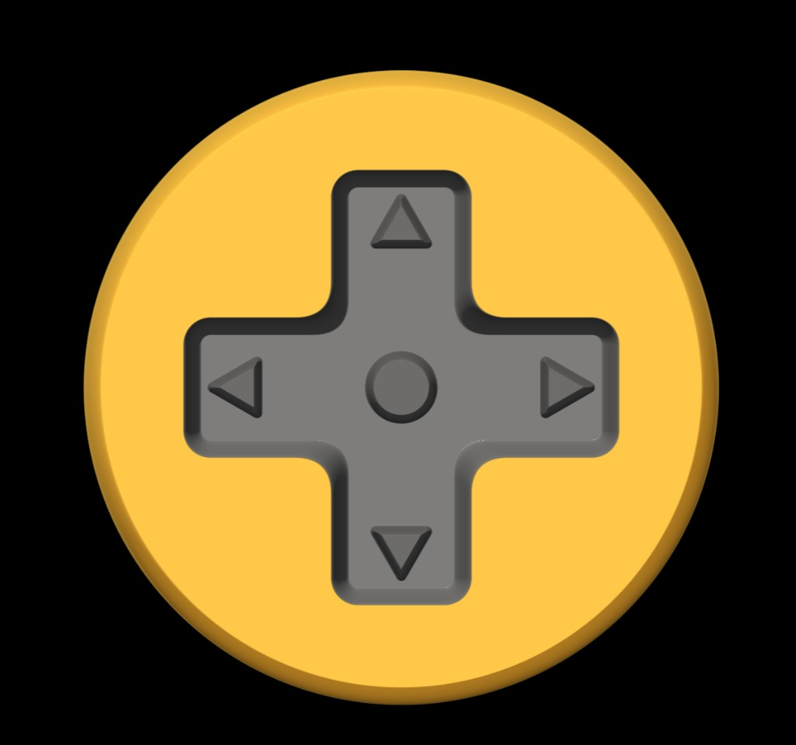

<h1 class="!text-white !mt-0 !mb-3 text-3xl font-bold">WebGPU в React Native</h1>

Теперь это полноценный native-стек

<!--
Дальше я хочу вам рассказать, что WebGPU получил нативную поддержку в реакт нейтив. В целом технология достаточно устоявшаяся, и уже была доступна на мобилке, но обычно через костыли.
-->

---
layout: full
---

<h2 class="!text-white !mt-0 !mb-3 text-xl font-bold">Что это значит на практике</h2>

<strong>react-native-webgpu</strong> — WebGPU на iOS и Android через <strong>Dawn</strong>. API совпадает с вебом: canvas, WGSL.

<ul class="!text-white text-sm space-y-2 list-disc pl-4 m-0">
<li><strong>Native build</strong> — <code>expo prebuild</code></li>
<li><strong>New Architecture</strong> — RN ≥ 0.81</li>
<li>Стек молодой, но уже с документацией и рабочими интеграциями</li>
</ul>

<!--
WebGPU стал доступен на мобильных платформах благодаря гугловской имплементации Dawn. Использует нативные инструменты платформы, доступен только на новой архитектуре
-->

---
layout: full
---

<h2 class="!text-white !mt-0 !mb-3 text-xl font-bold">Экосистема на WebGPU</h2>

<strong>react-native-webgpu</strong> — общий фундамент; сверху разные слои:

<ul class="!text-white text-sm space-y-2 list-disc pl-4 m-0">
<li><strong>React Native Skia</strong></li>
<li><strong>Redraw</strong></li>
<li><strong>Three.js / R3F</strong></li>
</ul>

<!--
1. Skia — переход с Ganesh (Metal / OpenGL) на Graphite -  WebGPU 
2. Redraw — 2D UI Kit на TypeGPU
3. Three.js / R3F — 3D в RN уже строится на том же WebGPU-стеке
-->

---
layout: full
---

<h2 class="!text-white !mt-0 !mb-3 text-xl font-bold">TypeGPU — шейдеры на TypeScript</h2>

Библиотека от Software Mansion — WebGPU без ручного WGSL:

<ul class="!text-white text-sm space-y-2 list-disc pl-4 m-0">
<li>Эффекты и анимация пишутся на <strong>TypeScript</strong> — привычный язык и типы</li>
<li><code>'use gpu'</code> — помечаете функцию, её тело уходит на GPU</li>
<li>Для React Native — готовые хуки вместо низкоуровневой настройки canvas</li>
<li>Компилятор сам собирает шейдер — не нужно держать WGSL в строках</li>
</ul>

<!--
TypeGPU - Библиотека TypeScript, расширяющая API WebGPU и позволяющая управлять ресурсами безопасным с точки зрения типов и декларативным способом.
-->

---
layout: full
---

<h2 class="!text-white !mt-0 !mb-0 text-lg font-bold">'use gpu' — так выглядит шейдер</h2>

<<< ../examples/video-shader-slide.ts

<!--
Так выглядит шейдер написаный с использованием TypeGPU - есть адекватная подсветка и автокомплит кода, не нужно держать простыни кода в обычных строках
-->

---
layout: full
---

<h2 class="absolute left-1/2 top-2 -translate-x-1/2 z-10 !text-white !mt-0 !mb-0 text-2xl font-bold text-center">Redraw</h2>

<strong>wcandillon.github.io/redraw</strong>

<!--
В этом году также показали инстересный 2d-ui toolkit на TypeGPU, он позволяет легко делать эффекты типа блура, объемность, анимацию и подсветку SVG. Пока проект в заркытом превью, хотя с ним можно поиграться их сандбоксе
-->

---
layout: full
---

<h1 class="!text-white !mt-0 !mb-0 text-3xl font-bold">Демо</h1>

<!--
Я накидал небольшое демо с TypeGPU, это видео плеер, все элементы на нем нарисованы в TypeGpu, искажения обрабатываются в шейдере, также поверх кадра наслаиваются разные фильтры
-->
