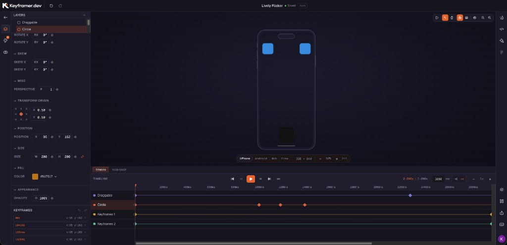
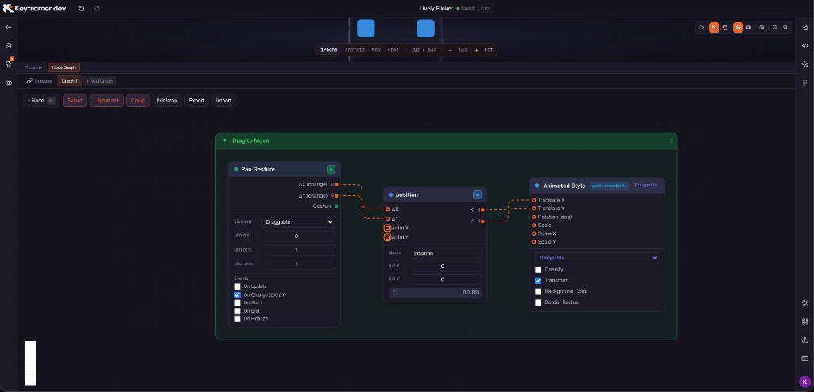
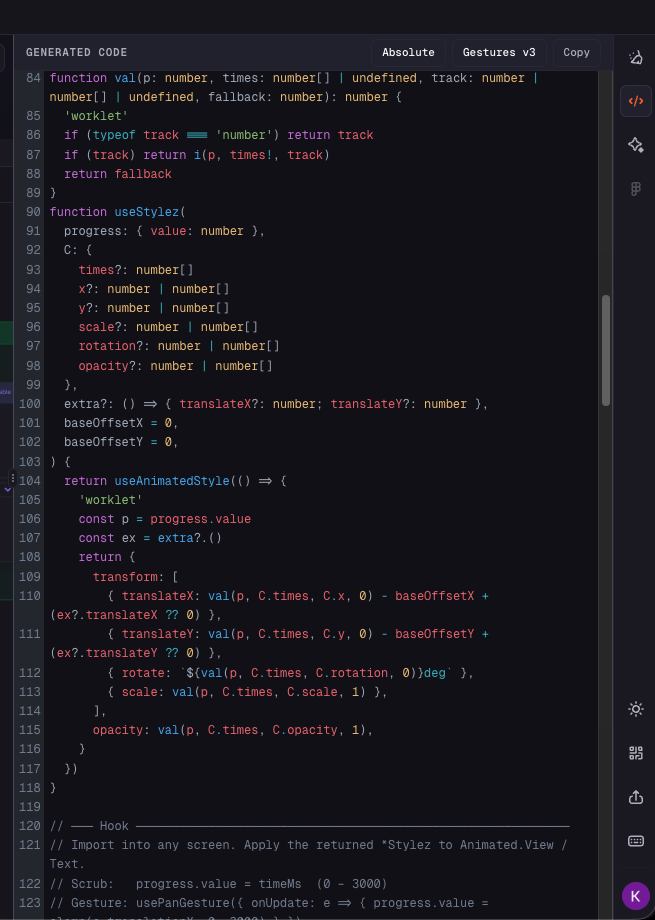

<h1 class="!text-white !mt-0 !mb-3 text-3xl font-bold">keyframer.dev</h1>

<h2 class="!text-white !mt-0 !mb-0 text-lg font-normal opacity-90">Графический редактор анимаций Reanimated</h2>

<!--
Speaker note: ~5–7 мин блок keyframer. Сегмент 5 — последний перед Q&A.
-->

---
layout: full
---

<h2 class="!text-white !mt-0 !mb-3 text-xl font-bold">Анимация в макете — не готовый код в приложении</h2>

В Figma дизайнер показывает, <strong>как должно двигаться</strong> — прототип, тайминги, кривые. На вебе похожий эффект часто собирают из <strong>CSS-анимаций</strong>.

В React Native путь другой и <strong>сложнее</strong>: жесты, spring, worklets — не CSS transitions. Из Figma это <strong>напрямую не вытащить</strong> — нужен Reanimated-код в проекте.

Разработчик обычно собирает анимацию <strong>вручную</strong> — по видео, скриншотам и устным пояснениям.

Currency.com app — сложные анимации реализовали вручную в Reanimated

<!--
Speaker note: контраст с вебом — CSS vs Reanimated. Figma не экспортирует RN-код. Currency.com app — one-liner без Figma-скрина. keyframer целится сократить разрыв, но пока alpha.
-->

---
layout: full
---

<h2 class="!text-white !mt-0 !mb-3 text-xl font-bold">Alpha · ограничения</h2>

<ul class="!text-white text-sm space-y-2 list-disc pl-4 m-0">
<li>Инструмент в <strong>alpha</strong> — сырой, функции и интерфейс ещё меняются</li>
<li><strong>Нет публичной документации</strong> — главный ориентир changelog на keyframer.dev</li>
<li>Подходит для <strong>простых сценариев</strong> — входная анимация, базовые жесты</li>
<li>Автор — <strong>Catalin Miron</strong> (AnimateReactNative.com): годами строит продукты и обучение на Reanimated — можно ждать полноценный редактор</li>
</ul>

<!--
Speaker note: manage expectations без техдеталей. Автор — Catalin Miron (AnimateReactNative.com). Не называть «разработчик Reanimated» — евангелист/практик. Дальше скриншоты редактора.
-->

---
layout: full
---

<h2 class="!text-white !mt-0 !mb-3 text-xl font-bold">Timeline</h2>

<ul class="!text-white text-sm space-y-2 list-disc pl-4 m-0">
<li><strong>Keyframes</strong> на треках — как в After Effects</li>
<li><strong>Easing</strong> между кадрами — кривая ускорения и замедления</li>
<li>Несколько свойств параллельно (opacity, scale, position)</li>
</ul>

<!--
Speaker note: timeline tab в редакторе. Плавность — easing-кривые, без spring на сегментах (ограничение alpha). Проект на скрине — generic demo, название не озвучиваем.
-->

---
layout: full
---

<h2 class="!text-white !mt-0 !mb-3 text-xl font-bold">Node Graph</h2>

<ul class="!text-white text-sm space-y-2 list-disc pl-4 m-0">
<li><strong>Жесты и события</strong> → значения анимации</li>
<li>Значения → <strong>стили на экране</strong> (Animated Style)</li>
<li>Для <strong>интерактивных</strong> анимаций — пружины, последовательности, интерполяция</li>
</ul>

<!--
Speaker note: graph — общая идея node graph. На скрине пример с drag, но не зацикливаться на названии. Runtime reactive input, не Figma prototype chains.
-->

---
layout: full
---

<h2 class="!text-white !mt-0 !mb-3 text-xl font-bold">Export · Generated Code</h2>

<ul class="!text-white text-sm space-y-2 list-disc pl-4 m-0">
<li>Генерирует хук <code class="text-xs">useAnimatedScene()</code> — keyframes, <code class="text-xs">useAnimatedStyle</code>, жесты</li>
<li>В проде <strong>не вставляем как есть</strong> — берём и адаптируем нужные куски</li>
<li>Стартовая точка: keyframes, интерполяция, pan — в свой layout и код</li>
</ul>

<!--
Speaker note: useAnimatedScene() — combined export. Честно: не drop-in модуль; вытаскиваем DRAGGABLE/KEYFRAMES, panGesture, useStylez-паттерн под свой экран. Copy — reference, не paste-and-ship.
-->

---
layout: full
---

<h2 class="!text-white !mt-0 !mb-3 text-xl font-bold">Когда tool созреет</h2>

Идея сильная — дизайнер и разработчик в одном Reanimated-пайплайне

<strong>Сегодня — alpha.</strong> Следим за changelog.

<!--
Speaker note: closing сегмента 6. Переход к «Вопросы?» в shell slides.md. Без live keyframer / Storybook / Expo.
-->
